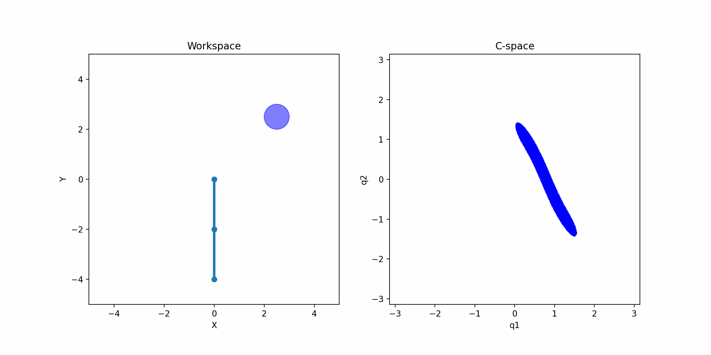

# Sampling-Based CBF Method for Safe Navigation

This method explores the integration of sampling-based techniques with Control Barrier Functions (CBF) to ensure safe navigation.

## Example: Single Integrator System

As a simple demonstration, consider a single integrator system where the method is applied to navigate safely while optimizing the control policy. Left is our approach, and right is the normal CBF.
<p align="center">
  
  
</p>

## Example: Path Planning in Configuration Space
We refer to the paper "Configuration Space Distance Fields for Manipulation Planning" (RSS 2024). In this example, we use the CDF (Configuration Distance Field) method proposed in the paper to calculate the distance and gradient in the configuration space. These are then used as inputs for the sampling-based CBF (Control Barrier Function) method to achieve efficient and constraint-aware path planning.
<p align="center">
  
</p>


## Sampling-Based Optimization

The sampling-based method iteratively optimizes a simple policy modeled as a time-independent Gaussian distribution with parameters $\phi_t$, which represent the sequence of means $\mu_t$ and covariances $\boldsymbol{\Sigma}_t$ at each time step.

At each iteration, the optimization follows these steps:
1. Sample a batch of $N$ control sequences, $u$, from the current distribution.
2. Roll out the approximate dynamics function using the sampled controls to obtain a batch of corresponding states $x$ and costs $c$.

## Cost Function Based on Angular Relations

A loss function is introduced to incorporate the angular relationship between obstacles and the goal:

```math
C(\theta_1, \theta_2) = \alpha_1(1 - \theta_1) + \alpha_2 \theta_2
```

where:
- $\theta_1 \in [90^\circ, 180^\circ]$ represents the angle between the noramm obstacle and the vector $x_{t+1} - x_t$, if smaller than $90^\circ$ will be zero.
- $\theta_2 \in [0, 180^\circ]$ represents the angle between the goal and the vector $x_{t+1} - x_t$.
- $\alpha_1$ and $\alpha_2$ are positive scalars.

## Updating Mean and Covariance

The mean and covariance of the control distribution are updated using a sample-based gradient:

$$
\begin{aligned}
    \mu_t &= (1 - \alpha_\mu)\mu_{t-1} + \alpha_\mu \frac{\sum_{i=1}^N w_i u_t}{\sum_{i=1}^N w_i} \\
    \Sigma_t &= (1 - \alpha_\sigma)\Sigma_{t-1} + \alpha_\sigma \frac{\sum_{i=1}^N w_i (u_t - \mu_t)(u_t - \mu_t)^\top}{\sum_{i=1}^N w_i}
\end{aligned}
$$

where:
- $\alpha_\mu$ and $\alpha_\sigma$ are step sizes that regulate updates relative to the previous values.
- $w_i$ is computed as:

$$
w_i = \exp \left( \frac{-1}{\beta} C(\theta_1, \theta_2) \right)
$$

To enhance diversity in the sampling process, noise is added to the covariance matrix. The best control input $u_{t+1}$ is then selected as $\mu_{t+1}$.

## Ensuring Safe Navigation with CBF

To prevent collisions with obstacles, a Control Barrier Function (CBF) is employed:

$$
\frac{\partial h}{\partial x} (f(x) + g(x) u) + \alpha(h(x)) \geq 0
$$

where:
- $h(x)$ represents the safe set, ensuring it remains non-negative.
- The function $h(x)$ can be formulated as a distance function to an obstacle.
- Only the closest obstacle is considered rather than all obstacles in the region.


